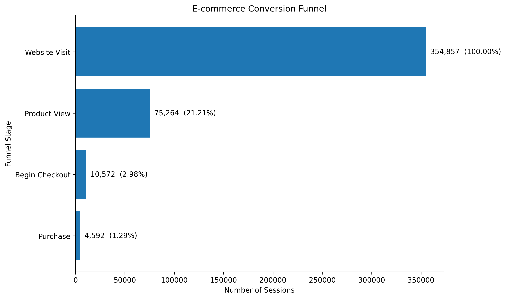
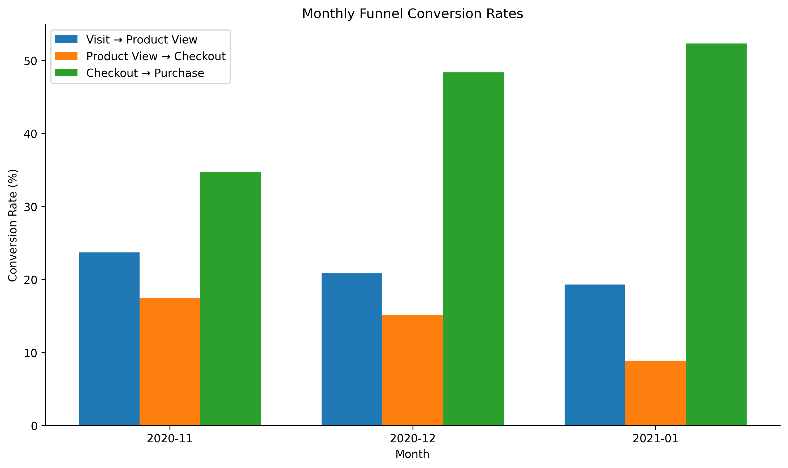
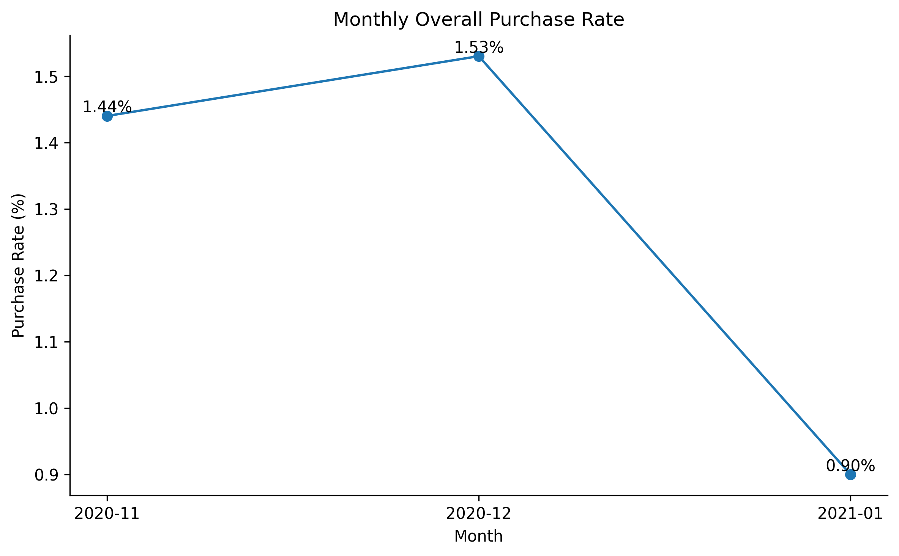
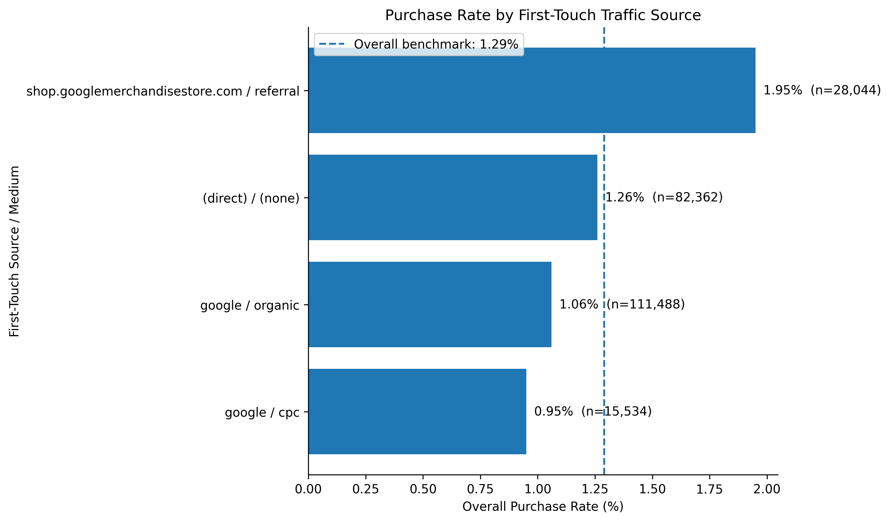
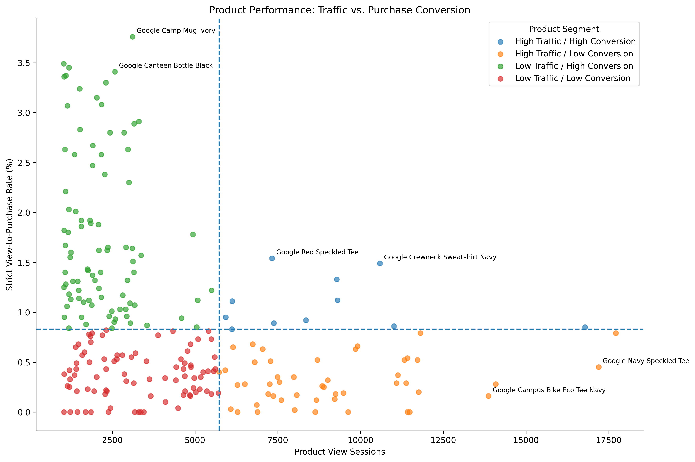

# GA4 E-commerce Conversion Funnel Analysis
## GA4 电商转化漏斗与增长诊断

这是一个基于 Google GA4 公共电商事件数据完成的个人数据分析项目。

我想模拟一个比较真实的产品数据分析场景：

> 网站有不少用户访问，但最终完成购买的比例并不高。用户到底主要流失在哪一步？问题是设备、流量来源、时间变化，还是具体商品造成的？如果我是负责这个业务的数据分析师，下一步应该建议产品和运营团队做什么？

项目主要使用 **BigQuery SQL** 完成数据清洗、会话级聚合和漏斗分析，再使用 **Python / pandas / matplotlib** 整理和可视化结果。

---

## 1. 分析思路

原始 GA4 数据是一行一个用户事件，不能直接拿事件次数计算购买漏斗。

因此我先用 `user_pseudo_id + ga_session_id` 构造会话级数据，再按照事件真实发生时间建立严格漏斗：

**Website Visit → Product View → Begin Checkout → Purchase**

整体分析流程如下：

```text
业务问题定义
→ 原始事件与数据质量检查
→ 构建会话级中间表
→ 严格购买漏斗
→ 设备 / 来源 / 国家 / 时间拆解
→ 商品表现分析
→ 订单和收入质量检查
→ 核心发现与业务建议
→ A/B Test 验证方案
```

---

## 2. 核心结果

### 2.1 购买漏斗的主要问题发生在前半段

在 **354,857** 个有效会话中：

| 漏斗阶段 | 会话数 | 相对上一阶段转化率 |
|---|---:|---:|
| Website Visit | 354,857 | — |
| Product View | 75,264 | 21.21% |
| Begin Checkout | 10,572 | 14.05% |
| Purchase | 4,592 | 43.44% |

严格会话级整体购买率为 **1.29%**。

相比已经进入结账的用户，最大的流失其实发生在用户进入商品浏览，以及浏览商品后是否继续进入结账这两个阶段。



---

### 2.2 1 月购买率下降，问题同样主要出现在漏斗前半段

整体购买率：

- 2020-11：**1.44%**
- 2020-12：**1.53%**
- 2021-01：**0.90%**

1 月的 `Checkout → Purchase` 转化率反而提高到了 **52.32%**，但：

- Visit → Product View 降至 **19.31%**
- Product View → Checkout 降至 **8.91%**

因此，1 月购买率下降并不是因为进入结账后的用户更难完成支付，而是因为更少的用户继续走到结账环节。





---

### 2.3 设备差异不明显，首次获客来源的差异更值得关注

desktop、mobile 和 tablet 的整体购买率都在约 **1.24%–1.33%** 之间，设备并不是当前最明显的问题来源。

相比之下，一些规模较大的首次获客来源表现低于全站 **1.29%** 的购买率基准：

- `google / organic`：约 **1.06%**
- `google / cpc`：约 **0.95%**

这使得搜索用户的意图与落地页面是否匹配，成为值得继续调查的方向。



> 注意：GA4 中这里使用的是 first-touch `traffic_source`，不等于当前购买会话的真实来源；数据中也没有完整广告成本，因此不能据此计算渠道 ROI 或直接建议削减广告预算。

---

### 2.4 商品之间存在明显的“流量 × 转化”分化

对于浏览量达到分析门槛的 233 个商品：

- **11 个**：高浏览 + 高转化
- **48 个**：高浏览 + 低转化
- **88 个**：低浏览 + 高转化
- **86 个**：低浏览 + 低转化

整体严格商品浏览到购买率基准为 **0.83%**。

例如：

**Google Campus Bike Eco Tee Navy**

- 商品浏览会话：13,866
- 严格浏览→购买率：**0.16%**

属于典型的高浏览、低转化商品，应该优先检查商品状态、库存、价格、SKU 映射或页面信息。

而：

**Google Camp Mug Ivory**

- 商品浏览会话：3,110
- 严格浏览→购买率：**3.76%**

浏览量相对较低，但购买转化明显高于平均水平，因此可以作为增加推荐曝光的候选商品。



---

## 3. 业务建议

根据分析结果，我把建议分成三个优先级方向。

### P0：先排查高浏览、低转化商品

对于浏览或加购规模很大、但后续购买很少的商品，第一步不应该直接做营销优化，而应该先确认：

- 商品是否缺货或下架
- SKU 与商品名称映射是否正常
- 规格选择是否存在问题
- 商品详情页和购买入口是否正常
- 浏览、加购和购买事件是否正确记录

先排除产品和数据问题，再讨论后续优化。

### P1：继续调查搜索来源与落地页面匹配

Google Organic 和 Google CPC 流量规模较大，但购买率低于整体。

如果是真实业务环境，我会继续补充：

- 搜索关键词
- 广告组
- Landing Page
- 当前会话来源
- CPC / 广告成本

判断到底是用户意图问题、落地内容问题，还是投放质量问题。

### P1：测试增加高转化、低曝光商品的展示

对于 `Google Camp Mug Ivory` 等低浏览、高转化商品，可以尝试提高推荐位置。

不过不能直接根据历史数据上线，因为高转化可能来自特定用户群体，也可能只是挤占其他商品的购买。

因此更合适的方法是做 A/B Test。

---

## 4. A/B Test 方案

我设计了一个实验，用来验证：

> 提高低浏览、高转化商品在推荐模块中的展示位置，是否能提高网站整体购买率？

**Control**

保持当前推荐排序。

**Treatment**

提高选定高转化商品的推荐位置。

**随机单位**

`user_pseudo_id`

**核心指标**

用户购买率

**辅助指标**

- 推荐商品点击率
- 商品浏览率
- 浏览→结账率
- 每用户收入

**护栏指标**

- 跳出率
- 整体客单价
- 其他商品购买率
- 退款率
- 页面性能

这里的 A/B Test 是基于分析结果设计的**验证方案，没有真实上线执行**。

---

## 5. 数据处理过程中遇到的问题

这个项目中比较有价值的一部分其实不是最后几个百分比，而是数据本身并不干净。

实际处理过程中发现：

- 一些会话缺少完整前置事件
- `item_id` 在不同电商事件之间并不稳定
- 同一个商品名称可能对应多个 SKU / item_id
- 部分 `transaction_id` 缺失
- 同一个订单号可能出现多条 purchase 事件
- 部分商品收入字段缺失

因此：

- 漏斗使用严格事件时间顺序
- 商品分析使用标准化后的 `item_name`
- 收入分析先按有效 `transaction_id` 去重
- 对无法可靠解释的数据不强行下业务结论

---

## 6. 项目结构

```text
ga4-ecommerce-analysis/
│
├── README.md
│
├── sql/
│   └── BigQuery SQL queries
│
├── data/
│   └── aggregated query results
│
├── notebooks/
│   └── visualization.ipynb
│
├── figures/
│   ├── 01_strict_core_funnel.png
│   ├── 02_monthly_funnel_conversion.png
│   ├── 02b_monthly_purchase_rate.png
│   ├── 03_source_purchase_rate.png
│   └── 04_product_quadrant.png
│
├── report/
│   ├── 33_core_findings
│   ├── 34_action_recommendations
│   ├── 35_ab_test_plan
│   └── final_business_report
│
└── docs/
    └── analysis_log
```

---

## 7. 这个项目练习了什么

这个项目让我完整走了一遍从业务问题到分析结论的流程，包括：

- 把模糊业务问题转成指标和分析路径
- 使用 BigQuery SQL 处理嵌套 GA4 事件数据
- 判断并统一数据粒度
- 构建可复用的会话级中间表
- 建立严格事件顺序漏斗
- 做时间、来源、国家和商品维度拆解
- 处理缺失、重复和口径不一致的数据
- 区分“发现相关关系”和“证明因果关系”
- 把分析结果转成业务建议
- 为业务建议设计后续 A/B Test 验证方案

这个项目的重点并不是做复杂模型，而是练习如何从真实业务问题出发，把数据分析结果变成可以执行、也可以继续验证的判断。